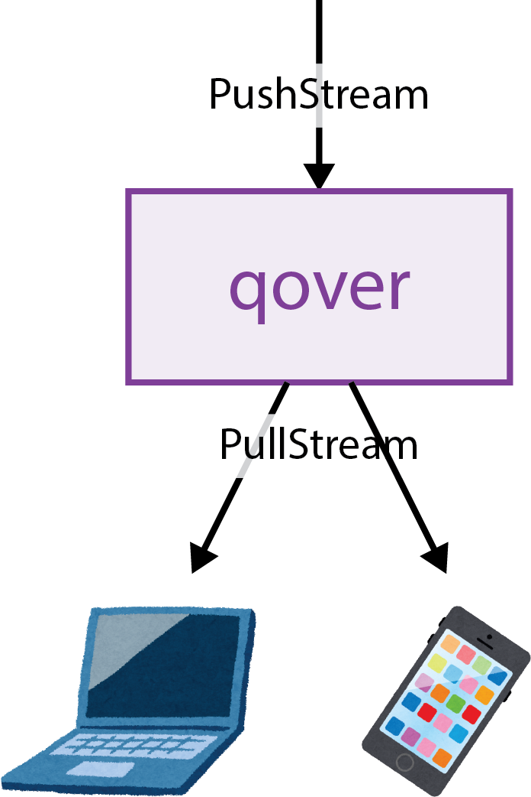

# qover

The `qover` is the gRPC server that transfers the data sent through PushStream as PullStream.



## Run

```
$ pip install poetry  # If poetry is not installed.
$ poetry install --no-root
$ poetry run python app.py --port=9090 --worker=50

# You can run with demo server (just sending PullStream)
$ poetry run python app.py --port=9090 --worker=50 --run_demo
```

Run with envoy proxy in Docker
```
$ docker-compose up
```

If you want to receive data in the browser, you have to use proxy due to the CORS.


